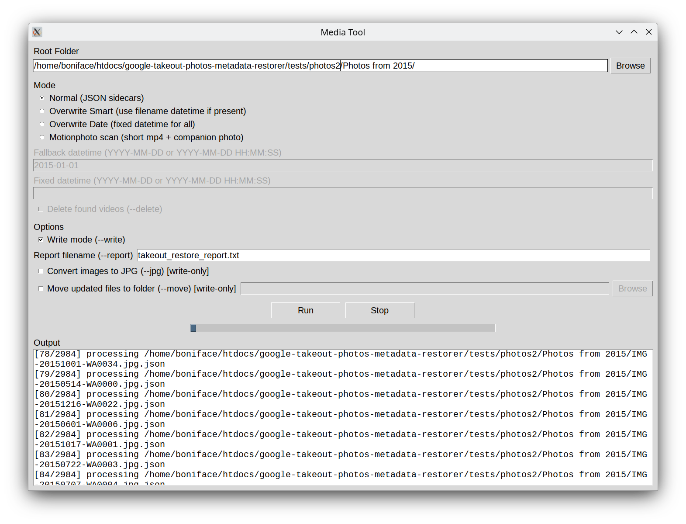
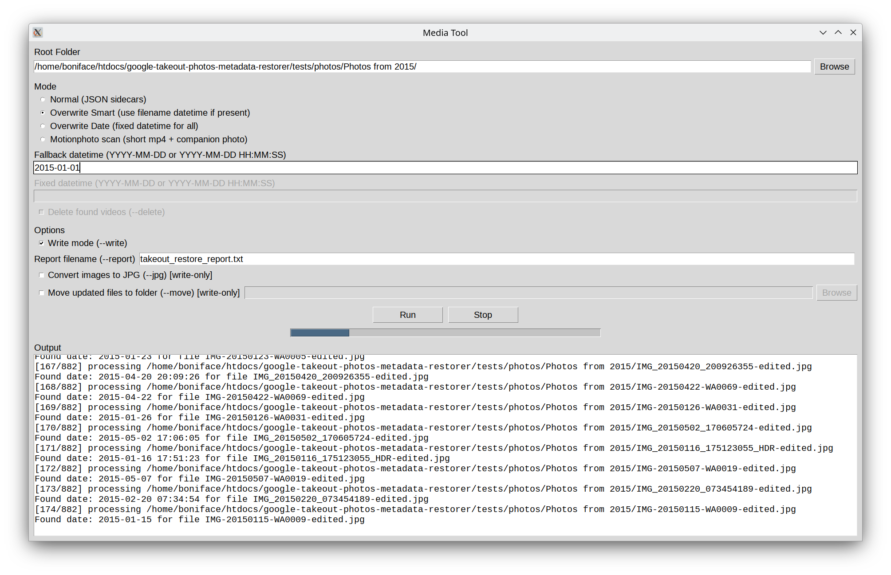

# Google Photos Takeout Healer

#### Heal your photos and videos from their identity crisis. Yes, they do remember when they were born.

#### Features:

- Scans and applies original creation date (or test run to see what's up)
- Works on Images and Videos
- Handles file name differences quirks
- Converts images to jpg, because it ensures 'photoTakenTime's existence.
- Finds media for json, they shall be no orphan json files (it will ask you to choose from similarly named media files or you can skip)
- Moves the healed media to a new folder. (leaving orphan media files behind that you can analyse)
- Features:
  - For orphan files that do not have json sidecar, overwrite smart identifies created date from the file's name
  - Or bulk update file's datetime to a fixed date.
- Shows progress, prints failures, and writes a summary report
- Easy, now you can upload on your self-hosted setup

### With UI 

Independent executable compiled for linux, windows and mac, with lightweight UI and small footprint. Includes all dependencies in one file.  

[Downloads](https://github.com/craftpip/google-takeout-photos-healer/releases)




### Or run it

### Requirements

- Python3.10
- exiftool is required (best-in-class for EXIF writing)
- ffmpeg is required for video timestamp restore

###### Install:

```
# debian
sudo apt update   
sudo apt install exiftool -y  
sudo apt install ffmpeg -y

# mac
brew install exiftool  
brew install ffmpeg

# windows
choco install exiftool
choco install ffmpeg
```

### Run code:

```
git clone <this repo>
cd <this repo>
python3.10 -m venv venv``
. venv/bin/activate
pip install -r requirements.txt 
python main.py --root "/path/to/takeout/" --write --jpg --move "/path/to/relaxation" 
```

#### Options

1. **--root** - path to your google takeout folder.
2. **--write** - write changes to your files (else it will run a dry test)
3. **--jpg** - convert your non-jpg images to jpg
4. **--move** - after tagging your files the json+media will be moved to this folder, preserving your directory structure
5. **--motionphoto** - find and list videos that are 2-3 second motion videos, created for motion photos
6. **--delete** - for motionphoto, delete the found videos.
